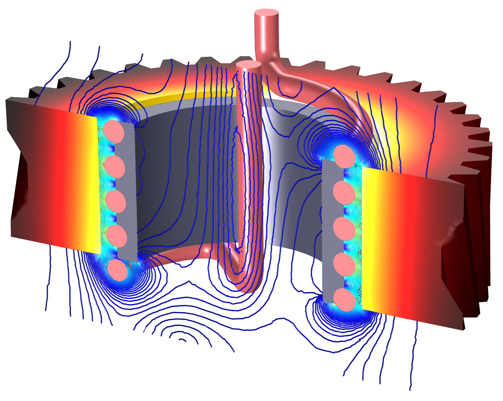

# Methods and Applications of Electromagnetic Field Simulation using Finite Integration Techniques

This repository contains implementations of Finite integrations technqiues from the paper [A discretization model for the solution of Maxwell's equations for six-component fields](https://ui.adsabs.harvard.edu/abs/1977ArElU..31..116W/abstract) by T. Weiland to simulate electromagnetic field problems.

  

## Overview

The repository is divided into seven distinct tasks. I will only provide a short overview here in this readme. A detailed description of each task and its solution can be found in the [protokellheft](https://github.com/paulffm/Methods-and-Applications-of-Electromagnetic-Field-Simulation-using-FIT/blob/main/Protokollheft.pdf).

## Task 1:
- Eigenvalue solver and convergence study
- Discretization of 3D objects
## Task 2:
- mesh creation
- creation of geomatric and topological matrices
- Imprinting given field distributions
## Task 3:
- material matrices
- boundary conditions
- interpolation of the fields
## Task 4:
- solver for the electrostatic problem
- solver for the magnetostatic problem
- calculation of capacities
- visualization and convergence study
## Task 5:
- solver for the magnetoquasistatic problem (vector and scalar) in frequency domain
- solver for the magnetoquasistatic problem (vector and scalar) in time domain
- error calculation and convergence study
## Task 6:
- solution for the high frequency problem in the time domain with Leapfrog
- study of the stability
- calculation of energy and power
## Task 7:
- investigation of the high frequency problem in time domain with lines and ports
- different line termination, different current excitations (reflection study)
